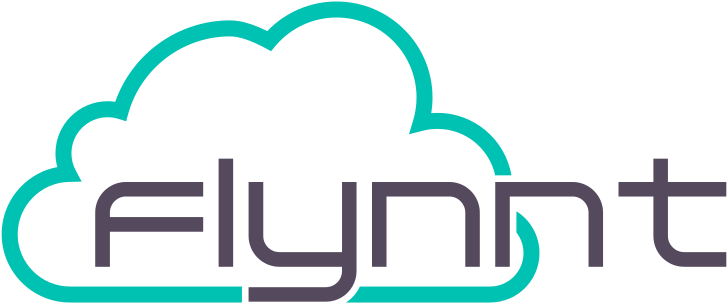

<h1 align="center">
  
+
  
</h1>

<h4 align="center">Deploy Minio on a Flynnt Cluster</h4>

---

This repository contains resources that deploy an instance of [Minio](https://min.io/) on a [flynnt](https://flynnt.io) kubernetes cluster.
It is build for private Cloud and on-premise environments.

The deployment is GDPR/DSGVO-compliant. This means, no data stored in your ArgoCD instance will leave your server. As long as you use trusted infrastructure providers (for example your own datacenter) your data is safe.

It is meant to be used for reference and as a blueprint for your own deployment.

#### Special features of this deployment
- Uses [Hetzner Cloud](https://www.hetzner.com/cloud) and the [Hetzner CSI Driver](https://github.com/hetznercloud/csi-driver) for compute nodes and as the StorageClass
- You can optionally use ArgoCD for your deployment. This is recommended, but not mandatory. The alternative is plain Helm/Kustomize. See here for a sample on [how to deploy ArgoCD](https://github.com/flynnt-io/flynnt-argocd-sample)

> **Note**
>
> Even though this sample is built to be deployed on a flynnt managed kubernetes cluster, you can easily customize this to use a different managed k8s provider.
> In general, almost every technology choice made here is opinionated and exchangeable with different products.

## Used Tooling

We use several open-source tools and stitch them together for a nice, standalone deployment experience.
- Terraform, Helm and Kustomize for deploying infrastructure, auxiliary apps and minio itself
- Sops and Age for secret encryption and handling

### Binaries
- [kustomize](https://github.com/kubernetes-sigs/kustomize/releases)
- [sops](https://github.com/getsops/sops/releases)
- [ksops](https://github.com/viaduct-ai/kustomize-sops/releases)
- [age-keygen / age](https://github.com/FiloSottile/age/releases)

## Prerequisites and External Dependencies

- At least two nodes to use in your cluster in different availability zones. (You can use the terraform instructions from below)
- An Ingress and Cert-Manager solution deployed to your cluster.
- A way to point your preferred DNS record to your nodes for ingress.
- A way to store secrets and share them with your team. As an example, a keepass database is sufficient.
- A kubernetes cluster and access via kubectl to it. This example uses a flynnt cluster. Save the `kubeconfig.yaml` in the root of this repo.
- (optional) A place to store the terraform state. If you work in a team, you should use some form of shared storage.
- (optional) An external prometheus-compatible monitoring layer. Because of the shared failure-domain with the application, it's not recommended to deploy prometheus, alertmanager and grafana in the same cluster.

## Getting Started

### Generate a new age secret
We included the `age`-binaries in this repository. Feel free to update or remove them. They are only used for this step.

```bash
./age/age-keygen
```
Copy the private and public key of the output and save it to your secret database. Both keys will be used throughout this repository.

### Deploy infrastructure with Terraform (optional)

You should only do this, if your flynnt cluster does not have any nodes. This uses [Hetzner Cloud](https://www.hetzner.com/cloud) to deploy compute nodes and you need an [Hetzner API Key](https://docs.hetzner.com/cloud/api/getting-started/generating-api-token/) to use this.

We have some secrets that we want to use with terraform. Namely, our `hcloud_token` and the `flynnt_token`. We obviously don't want to store them in plain text in git, so we need to encrypt them first.

To do this, there is a `terraform/secrets.sample.yaml` file in this repo. It contains sample values. Replace them with real values. Next, we encrypt the file to be used by terraform as variables.

```bash
./sops --encrypt --age <put-age-public-key-here> terraform/secrets.sample.yaml > terraform/secrets.enc.yaml
```

> **Important**
> Don't commit the plain secrets file to git. The `secrets.enc.yaml` is fine to commit though. That's the whole point of `sops` and `age`.

Next, we will deploy the nodes through terraform and join them to a flynnt cluster. If you want to use a different backend to store your state, customize the `terraform/main.tf` accordingly.
Also, check the `terraform/terraform.tfvars` file for the correct cluster name.

```bash
export SOPS_AGE_KEY=<put-private-secret-key-here>
terraform -chdir=terraform init -upgrade #(only on first deploy)
terraform -chdir=terraform apply
```
Check that the nodes are successfully added to the cluster. Either through the [Flynnt Dashboard](https://app.flynnt.io) or directly by using `kubectl get nodes`

### Prepare k8s and sops secrets

We need to provide two secrets for this deployment to work.

The first is for the Hetzner CSI Driver to access the Hetzner API. This is optional if you are using a different CSI provider.
It's located in `applications/hetzner-csi-driver/secrets.sample.yaml`. Change it and encrypt it.

```bash
./sops --encrypt --age <put-age-public-key-here> applications/hetzner-csi-driver/secrets.sample.yaml > applications/hetzner-csi-driver/secrets.enc.yaml
```

The second secret you need to change is in `applications/minio/secrets.sample.yaml`. This will be the login credentials for your tenant.
Change them and encrypt the secret

```bash
./sops --encrypt --age <put-age-public-key-here> applications/minio/secrets.sample.yaml > applications/minio/secrets.enc.yaml
```

Now you are ready to deploy Minio.

### Deploy Minio via ArgoCD (_recommended_)

If you have [ArgoCD](https://argoproj.github.io/cd/) installed in your cluster, you can simply customize the `argocd-appliations.yaml` to your needs.
ArgoCD needs access to this repository if you want this to work.

```bash
kubectl apply -f argocd-applications.yaml
```

See [this repository](https://github.com/flynnt-io/flynnt-argocd-sample) on how to install ArgoCD to your cluster.

> **Note**
>
> The [Hetzner CSI Driver](https://github.com/hetznercloud/csi-driver) is included in this deployment. If your cluster is not using compute nodes from Hetzner, replace it with the StorageClass of your choice.

### Deploy Minio via Helm & Kustomize

#### Deploying Hetzner CSI Driver (optional)
This is optional if you already have a different CSI provider deployed.
The kustomize below automatically decrypts the secret by using ksops. This is also exactly how ArgoCD would do it.
```bash
export KUBECONFIG=kubeconfig.yaml
./kustomize build --enable-alpha-plugins --enable-exec applications/hetzner-csi-driver | kubectl apply -f -

```
#### Deploying Operator & Tenant

First, we need the Minio Operator. We use the default values. So no separate values.yaml.
```bash
export KUBECONFIG=kubeconfig.yaml
./helm repo add minio https://operator.min.io/
./helm upgrade --install --namespace minio-operator --create-namespace --version 5.0.9 minio-operator minio/operator
```

Now deploy the actual tenant.
Customize `applications/minio/values.yaml` and add your Ingress domain and TLS configuration. The sample configuration works for ingess-nginx and cert-manager.
```bash
export KUBECONFIG=kubeconfig.yaml
./kustomize build --enable-alpha-plugins --enable-exec applications/minio | kubectl apply -f -
./helm repo add minio https://operator.min.io/
./helm upgrade --install --values applications/minio/values.yaml --namespace minio-tenant --create-namespace --version 5.0.9 tenant-1 minio/tenant
```
You should now be able to access your Minio Tenant console and buckets through the configured Ingress. 

## Encryption of secrets
We use [sops](https://github.com/mozilla/sops) and [age](https://github.com/FiloSottile/age).

Editing the secrets file inline:
```bash
SOPS_AGE_KEY=<put-secret-key-here> ./sops -i secrets.enc.yaml
```
